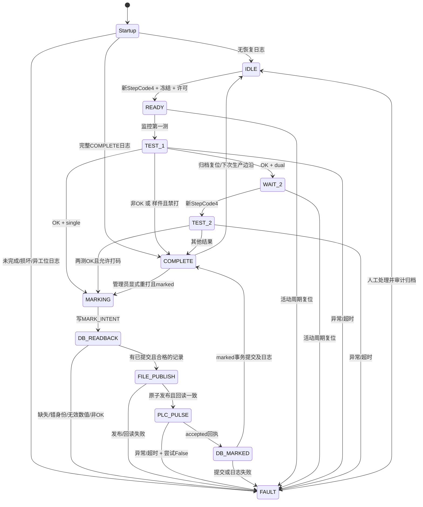
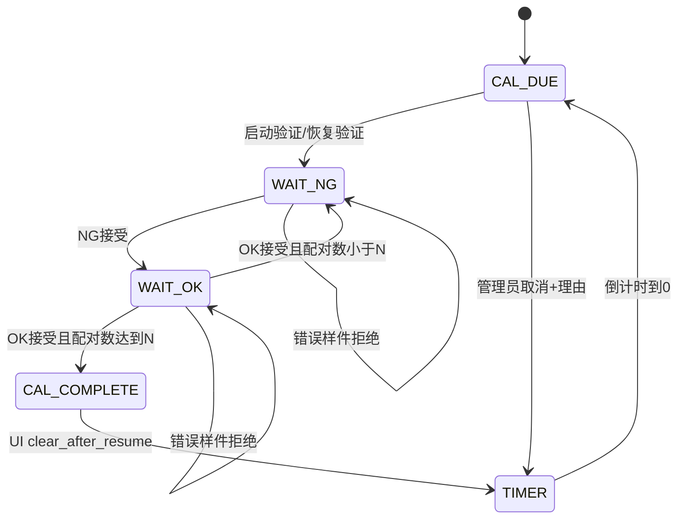

# ATEQ F620 结构化需求与审查

## 0. 文档控制

|字段|值|
|---|---|
|文档ID|F620-SRS-20261007|
|版本|1.0|
|日期|2026-10-07 Asia/Shanghai|
|代码来源|https://github.com/huaweixiong-debug/ATEQ-F620-Laser-2-stations|
|固定提交|c22accdf965bf25ea8b6bca14c10910a6f82d0c9|
|基线测试|64 passed / Python 3.10.11 / 离线 Qt offscreen|
|实现范围|纯决策函数提取；数据库权威打码门禁；日期冻结；激光异常断电；管理员重打码服务门禁|
|禁止项|改变合格判定、检测顺序、样件行为、增加自动重测/重打、改现场点位、数据库迁移、连接设备、部署|
|原本地目录|Y:\协众\101 ATEQ F620 双腔 + 激光打码；含用户未提交修改；保留原状|
|工作分支|codex/f620-structured-spec（独立克隆）|
|状态|IMPLEMENTATION_AUTHORIZED_OFFLINE|

## 1. 来源与业务不变量

|ID|规则|代码来源|类型|
|---|---|---|---|
|BR01|A/B 每个进程只控制一个工位；拒绝 selection.station 不匹配|README.md; station.py:start_cycle|冻结|
|BR02|无扫码；cycle_id=工位+UTC时间+短UUID|station.py:start_cycle|冻结|
|BR03|LIVE 物理测试由硬件启动；上位机监控；external_start=True 时不得 start_test|station.py:_run_ateq; ateq.py:SerialAteq|冻结|
|BR04|新的 StepCode=4 边沿才派发；重复4忽略；READY→第一测，WAIT_2→第二测|ui_replica.py:_handle_live_stepcode|冻结|
|BR05|冻结型号、人员、模式、ATEQ程序号、日期方案；活动周期不受界面后续改动影响|CycleSelection; ModelConfig.date_scheme; start_cycle|既有意图补齐日期传递|
|BR06|第一测非OK→COMPLETE，无第二测，无打码；UNKNOWN不擅自转换为OK|station.py:test_first|冻结|
|BR07|第一测OK且样件且mark_samples=False→COMPLETE，优先于single/dual分支|station.py:test_first|冻结；含dual样件提前结束|
|BR08|第一测OK：single→MARKING；dual→WAIT_2（BR07优先）|station.py:test_first|冻结|
|BR09|第二测OK且第一测OK→MARKING；任一非OK→COMPLETE；禁止额外复测|station.py:test_second|冻结|
|BR10|第二测样件且mark_samples=False→COMPLETE|station.py:test_second|冻结|
|BR11|打码字段来自已提交数据库回读；禁止缓存和过程记录替代|README.md; station.py:mark|实现纠偏|
|BR12|打码仅single第一测OK或dual两测OK；回读缺失/错误/无效→FAULT，无marker调用|README.md; station.py:mark|实现纠偏|
|BR13|打码文本8行：日期/型号/P1/L1/P2/L2/结果/操作工；三位小数；单位来自测量|laser.py:build_mark_text|冻结|
|BR14|文件临时写+fsync+os.replace+逐字节回读；文件失败不得发PLC脉冲|laser.py:LaserFileWriter.publish|冻结|
|BR15|一次打码仅一个True启动写；置位回读→保持→False→低位回读→settle→可选done|laser.py:LaserMarker.mark|冻结|
|BR16|激光PLC阶段异常：再次尝试False，不重发True；失败说明断电未确认|laser.py:mark; station.py:_safe_fault|补齐异常清理|
|BR17|已accepted后才更新marked；更新失败→AMBIGUOUS+FAULT，禁止自动重打|station.py:mark|冻结|
|BR18|完整完成日志恢复为COMPLETE；其他未完成/损坏/异工位→FAULT+恢复要求|station.py:_restore; journal.py|冻结|
|BR19|重打码只允许管理员，且COMPLETE+record.marked；重打是新的物理脉冲，不宣称幂等|permissions.py:allows; ui_replica.py:remark|补齐服务层门禁|
|BR20|校准按NG→OK交替；required_samples=N表示N对；默认2小时；错误样件不累计|calibration.py:sample/tick|冻结|
|BR21|第一测dual OK在生产仓储中仅pending；第二测提交；首测NG和single直接提交|repository.py:insert_stage1/update_stage2|冻结；不迁移schema|
|BR22|不添加任何自动重测、自动重打或数据库重试；人工下一周期另生成cycle_id|station.py; repository.py|冻结|

## 2. 状态与事件

|状态|进入条件|允许事件|退出条件|
|---|---|---|---|
|IDLE|无活动周期|START; CAL_BEGIN|合法冻结→READY|
|READY|周期已记录|TEST_FIRST; RESET|第一測开始→TEST_1|
|TEST_1|第一测运行|ATEQ_RESULT; IO_ERROR|BR06/07/08或FAULT|
|WAIT_2|生产dual首测OK|TEST_SECOND; RESET|第二测开始→TEST_2|
|TEST_2|第二测运行|ATEQ_RESULT; IO_ERROR|BR09/10或FAULT|
|MARKING|合格检测完成|MARK; IO_ERROR|MARKED→COMPLETE；失败→FAULT|
|COMPLETE|检测终结或打码事务完成|RESET; REMARK(admin且marked); 新硬件边沿|归档→IDLE；重打→MARKING|
|FAULT|I/O、日志、身份、打码错误|人工恢复; UI现有恢复通路|审计归档→IDLE；不自动续跑|
|CALIBRATION|枚举兼容值|无控制器实际赋值|校准使用独立CalibrationPhase|

## 3. 整体状态机

## 4. 每步业务、分支、超时、重试、报警

|步骤|前置/输入|动作顺序|OK分支|NG/拒绝分支|超时|自动重试|报警/恢复|
|---|---|---|---|---|---|---|---|
|S00启动|配置/恢复日志|读取版本与身份|无日志→IDLE；完整→COMPLETE|损坏/未完成→FAULT|日志未设超时|0|RECOVERY_REQUIRED；startup_safe_stop|
|S01预检|LIVE配置|点位确认；PLC读回；端口；文件目录；型号日期；schema|全部通过才装配|任一BLOCKED阻断LIVE|TCP2s；ATEQ0.6s；MySQL5/10/10s|0|LIVE_BLOCKED；本次不运行真实预检|
|S02开周期|新4边沿，许可，IDLE，选择一致|冻结→程序选择→record→READY→journal|继续首测|权限/选项失败拒绝；journal失败FAULT|程序串口默认1s|0|拒绝或journal错误；不虚构产测|
|S03第一测|READY|TEST_1→序号+1→intent日志→run→身份校验→结果日志→stage1|BR07/08|BR06→COMPLETE；I/O错FAULT|cycle120s；串口1s；UI用0.8s|0；轮询不是重试|第一次测试失败；恢复锁定|
|S04等第二测|WAIT_2|等新4边沿|进入TEST_2|非法事件拒绝|等待第二边沿无独立超时|0|不增加未定义超时|
|S05第二测|WAIT_2|TEST_2→序号+1→intent→run→身份校验→stage2提交|两OK→MARKING|非OK→COMPLETE；异常FAULT|同S03|0|第二次测试失败；恢复锁定|
|S06打码回读|MARKING|INTENT日志→get_committed→类型/身份/时间/字段/测量校验|深拷贝回读；覆盖仅无schema元数据|None/异常/NG/NaN/Inf/缺测→FAULT；marker调用0|MySQL连接5s，读10s|0|打码失败；AMBIGUOUS按现有INTENT策略|
|S07发布TXT|已校验回读|8字段→编码→temp→fsync→replace→bytes verify|进入脉冲|文件失败无PLC触碰|文件无独立超时|0|返回拒绝回执|
|S08脉冲|文件已验证|True→读高→hold→False→读低→settle|done关闭时accepted|任一步失败→尝试False→拒绝|hold1s；settle0.2s|0；False清理最多额外1次|断电写失败追加未确认说明|
|S09完成位|wait_done=True且点位存在|每50ms读done|高→accepted|截止仍低→拒绝|10s默认|0|无完成位且wait_done=True：沿用现有跳过行为并登记审查风险|
|S10保存打码结果|accepted|PULSED日志→DB intent→marked更新→DB commit→MARKED日志→COMPLETE日志|成功结束|异常→FAULT+AMBIGUOUS|DB5/10/10s|0|禁止自动重打，人工确认物理状态|
|S11清空TXT|脉冲成功或PLC阶段失败|启动异步清空定时器|默认10s清空|clear异常当前被吞掉|10s；<=0关闭|0|现有无报警：审查风险，不在本轮改定时语义|
|S12重打|管理员且完成且marked|权限→MARKING→同S06-S10|新脉冲，保留业务内容|拒绝权限/状态无副作用|同S06-S10|0|显式人工重打；非物理幂等|
|S13复位/恢复|终态/故障|活动复位fault；终态归档；人工恢复审计|IDLE|恢复要求且有record时普通reset拒绝|无|0|UI当前存在require_permission=False通路，登记风险|
|S14校准|到期或锁定|NG→OK配对；UI释放周期；计时|N对完成，生产释放|顺序错误不累计|period默认7200s|人工重新放样件|顺序错误；取消仅admin+非空原因|

## 5. 打码回读数据契约

|字段|权威来源|有效条件|不符合动作|
|---|---|---|---|
|station/cycle_id|DB表/DB字段|等于冻结工位和cycle_id|禁止marker|
|part_no/person/created_at|DB行|非空str；datetime|禁止marker|
|first/second|DB数值/单位/Result|Measurement；数值非bool、有限；单位str；Result.OK|禁止marker|
|single所需测量|冻结模式|first必需；存在second时也必须OK|禁止marker|
|dual所需测量|冻结模式|first和second均必需且OK|禁止marker|
|test_mode/sample_cycle/date_scheme/ateq_program|冻结周期元数据|schema v2未存储；仅覆盖这些字段；不得覆盖DB业务字段|元数据无效禁止marker|
|get_committed(MySQL)|真实SELECT|每次查询DB；不得返回records/_pending；未知工位映射只读搜索A/B并拒绝重复|无行→None；重复→错误|
|get_committed(Fake)|独立提交快照|insert/update/mark时深拷贝；后续改过程记录不改变已提交快照|保持get/query旧接口兼容|

## 6. 审查发现与处理状态

|ID|优先级|证据|根因/风险|本轮处理|
|---|---|---|---|---|
|AUD01|P1|station.py:mark; repository.py:get|缓存优先+None退内存；违背打的数据=存的数据|FIX：独立get_committed+门禁|
|AUD02|P1|laser.py:mark异常块|hold/read/reset异常后缺少统一False|FIX：异常额外False尝试；不重发True|
|AUD03|P2|CycleSelection; UI四个选择入口|date_scheme未传；型号日期设置未进入冻结记录|FIX：默认兼容字段+四入口冻结|
|AUD04|P1|station.py:remark; permissions.py|仅UI管理员门禁；直接调用绕过|FIX：服务层require remark|
|AUD05|P1|permissions.py:AuthSession.login|演示管理员密码在demo=False仍被接受|DEFERRED：身份策略需独立需求；非本轮函数实现范围|
|AUD06|P1|ui_replica.py:reset; station.py:resolve_recovery|UI显式绕过管理员恢复；与部分提示相冲突|DEFERRED：恢复角色边界需业务裁定；不擅改授权流程|
|AUD07|P1|laser.py:wait_done分支|wait_done=True但无点位静默跳过；旧高位不能证明本次完成|DEFERRED：需现场完成位握手协议；不发明边沿要求|
|AUD08|P2|laser.py:_clear_channel/_cancel_clear_timer|清空异常吞掉；已执行旧timer可能清新文件|DEFERRED：需单独并发事务设计；本轮保留定时规则|
|AUD09|P2|station.py:test_first; repository.py:insert_stage1|dual样件禁打首测即完成；生产仓储首OK仅pending|DEFERRED：保持现有业务；本轮测试锁定，不把样件改成双测|
|AUD10|P2|README.md; 原本地station.py|正负压顺序描述不一致|OPEN_FIELD：只定义TEST_1/TEST_2；现场映射待确认|
|AUD11|P2|ui_replica.py:_run_test_async/heartbeat/reset|线程与复位/程序设置的跨事务竞态需专门验证|DEFERRED：本轮不改线程架构|
|AUD12|P2|live_preflight.py:run_preflight|probe_devices=False仍TCP/MySQL；非纯离线入口|DEFERRED：本次不运行真实预检|

## 7. 验收与发布状态

|门禁|必须证据|结果要求|
|---|---|---|
|G01|纯函数所有组合+非法输入|PASS|
|G02|回读拒绝矩阵+DB缓存分歧+single/dual|PASS|
|G03|脉冲异常True计数与False清理|PASS|
|G04|日期冻结+权限+恢复日志|PASS|
|G05|原有64测试+新增测试统一pytest|0失败；不删除/跳过旧用例|
|G06|simulate smoke|返回0且COMPLETE/marked|
|G07|原目录hash基线|无本轮代码覆盖|
|G08|GPT-6 Luna极高审查|PASS或明确保留项|
|G09|现场准入|NOT_EXECUTED；点位/腔序/完成位/真实串口/真实MySQL未验收|
